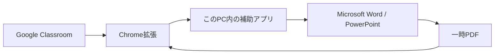

# Classroom Office Reviewer（CRW）

Google Classroomの採点画面内で、Word／PowerPoint／Googleドキュメント／Googleスライドの提出物を、できるだけ元のレイアウトを保ったPDFとして連続表示するWindows向けChrome拡張です。

Word／PowerPointはPC上のMicrosoft OfficeでPDFに変換し、Googleドキュメント／GoogleスライドはGoogle側のPDF書き出しを取得します。いずれも拡張機能内のPDFビューアーで表示するため、Googleの編集画面をそのまま埋め込んで表示する方式ではありません。

- 学生を「前へ・次へ」で切り替えながら連続確認（次の変換中も前の表示を維持）
- 1人が複数ファイルを提出していても、すべて準備して切り替え表示
- ビューアー内の提出物一覧（学生名・ファイル名検索、選択、スクロール）
- 同じ課題で過去に読み込んだ提出物と保存済みPDFの一覧復元
- Word／PowerPoint本体でPDF化し、レイアウトをできるだけ保って表示
- Googleドキュメント／GoogleスライドをGoogle側でPDF書き出しし、同じビューアーで表示
- Word別ウィンドウ、PowerPointスライドショー
- PDF全画面発表とキーボードページ送り
- 提出物を1つのZIPにまとめて一括ダウンロード（提出物一覧のCSV付き）
- 提出物を外部サーバーやAIへ送信しないローカル処理

> [!IMPORTANT]
> 本ツールはGoogleおよびMicrosoftの公式製品ではありません。Chromeウェブストア版ではないため、初回だけ拡張機能を手動で読み込みます。

## 動作環境

- Windows 10／11
- Google Chrome
- Microsoft Word（Word提出物を扱う場合）
- Microsoft PowerPoint（PowerPoint提出物を扱う場合）

配布ZIPには補助アプリの実行環境を同梱するため、Node.jsの別途インストールは不要です。

## 導入（初回のみ・約3分）

1. [最新版の配布ページ](https://github.com/MLabPages/classroom-office-reviewer/releases/latest)から `Classroom-Office-Reviewer-Windows.zip` をダウンロードします。
2. ZIPを右クリックして「すべて展開」します。ZIPの中から直接起動しないでください。
3. 展開先の `Start-Reviewer.cmd` または Chrome連動で自動起動するための `Install-NativeHost.cmd` をダブルクリックします。
4. `Open-Chrome-Setup.cmd` をダブルクリックします。
5. 開いたChrome画面で右上の「デベロッパー モード」をオンにします。
6. 「パッケージ化されていない拡張機能を読み込む」を押し、`extension` フォルダを選びます。
7. 開いているClassroomを再読み込みします。

Windowsの警告が出た場合は、ファイル名と配布元がこのリポジトリであることを確認してから実行してください。

## 使い方

ClassroomでWord、PowerPoint、GoogleドキュメントまたはGoogleスライドの提出物を開くと、左下に操作パネルが表示されます。

| ボタン | 動作 |
|---|---|
| Wordで正確に表示 | Word本体でPDF化し、採点画面内に表示 |
| Word別窓で表示 | Word本体で読み取り専用表示 |
| PowerPointを正確に表示 | PowerPoint本体でPDF化し、採点画面内に表示 |
| PowerPointで発表 | PowerPoint本体のスライドショーを開始 |
| Googleドキュメント／スライドを表示 | Google側でPDFとして書き出し、採点画面内に表示 |
| 全員分を一括準備 | 先頭から順に元ファイル取得とPDF化を済ませ、採点・発表時の待ち時間をなくす |
| 提出物をZIPで一括ダウンロード | 提出済みの全員分をまとめて1つのZIPとして保存 |
| 全画面 | PDFを発表用に全画面表示 |
| 機能OFF | 自動表示・プレビュー・Office別窓を停止 |

### 表示中の操作（プレビュー上部）

| ボタン | 動作 |
|---|---|
| ‹ › | 同じ学生の別ファイルを先に表示し、最後／最初で次／前の学生へ移動（Classroomの表示と同じ順番・同じファイル） |
| 1/2 ▾ | 1人が複数ファイルを提出している場合に、ファイルを切り替える |
| 一覧 | 同じ課題で取得済みの提出物を学生名・ファイル名で検索し、選択 |
| − ＋ | 表示倍率の変更 |
| 全画面 | 発表用の全画面表示（矢印キー・PageUp／PageDown・Spaceでページ送り、Escで終了） |
| ⋯ | 幅いっぱいに広げる／大きさを自動に戻す／全員分を一括準備／機能OFF |

表示枠の**上辺・右辺・右上の角をドラッグ**すると、好きな大きさに変えられます。大きさは記憶され、次に開いたときも同じ大きさになります。角をダブルクリックすると自動の大きさへ戻ります。採点欄を見ないときは、⋯の「幅いっぱいに広げる」でClassroomの右側まで使えます。

ビューアーの「一覧」は、現在のClassroom画面で取得した提出物と、同じ課題についてこの拡張機能が過去に記録した一覧メタデータを統合します。保存済みPDFが残っている項目は、Classroomの再取得を待たずに保存済みPDFを表示します。提出物の本文や元ファイルそのものは一覧メタデータへ保存しません。

### 全員分を一括準備

採点や授業の前に「全員分を一括準備」を押すと、Classroomをもう1枚開いた**準備専用タブ**が前面に出て、先頭の提出者から順にWord／PowerPointの取得・PDF化と、Googleドキュメント／スライドのPDF取得を行います。

- 準備専用タブは1枚だけ開き、処理のたびに増減しません。完了すると自動で採点タブへ戻ります（準備専用タブは閉じずに残ります）。
- 採点タブに切り替えても準備は続きます。進行状況は右下のパネルに、準備件数・現在のファイル名・経過時間・1件あたりの目安として表示されます。
- Chromeが背面のタブの画面更新を止めた場合は、パネルが黄色い案内に変わります。「準備タブを開く」を押すと、止まっていたところから自動で再開します。
- 1人が複数ファイルを提出している場合は、そのすべてを準備します。2件目以降はファイル番号から直接取得するため、Classroomの表示を切り替えずに済みます。
- PDFなど対象外の提出物は、保存画面を開かず読み飛ばします。パスワード付きなど変換できないファイルは「準備できず」として記録し、次の提出者へ進みます。
- 「次の提出物を自動表示」をオンにすると、学生を切り替えるたびに準備済みPDFへ自動で切り替わります。

### 提出物をZIPで一括ダウンロード

採点画面の操作パネルにある「提出物をZIPで一括ダウンロード」を押すと、整理方法を選ぶ画面が出ます。選んで実行すると、Classroomの提出者を先頭から順に確認し、提出物をまとめた**ZIPを1つだけ**ダウンロードします（任意のフォルダーへ大量のファイルを直接保存する方式は使いません）。

- 整理方法は「全員のファイルを同じフォルダに保存」と「学生ごとのフォルダに分けて保存」から選べます。前回の選択を覚えていますが、毎回変更できます。
- ファイル名の構成は「学生の識別名＋課題名＋元のファイル名」と「学生の識別名＋課題名」から選べます。Windowsで使えない文字は `_` に置き換え、同名のファイルには `_02`、`_03` を付けます。
- Googleドキュメント／スプレッドシート／スライドは、`.docx` `.xlsx` `.pptx` に変換したものと、**Google上の原本を開く `.url`** の両方を入れます（変換ファイルにはコメントや変更履歴、共有状態が残らないためです）。Google図形描画はPDFと `.url`、一般Webリンク・YouTube・Googleフォームは `.url` だけを入れます。
- ZIP直下に `提出物一覧.csv`（Excelで開いても文字化けしないBOM付きUTF-8）と `提出物一覧.json` を入れます。学生の識別名・氏名・提出状態・元の提出物名・種類・ZIP内の保存先・元URL・取得結果・警告を記録します。
- 未提出の学生はZIPにフォルダーを作らず、一覧に「未提出・対象ファイルなし」として記録します。処理中に未提出者で止まりません。
- 取得や変換に失敗しても処理は止まりません。元URLが分かる場合は `.url` を残し、理由を一覧に記録します。完了画面から「失敗した項目だけ再取得」もできます。
- 処理中は進捗を表示し、いつでも中止できます。実行中はボタンが押せなくなり、二重に始まりません。

#### 学生の識別名について

Classroomの表示名をもとに、ファイル名の先頭に使う識別名を3つから選べます。

| 選択 | 動作 |
|---|---|
| 表示名の先頭番号を使う | `26_0001 学生A（Student A）` → `26_0001` |
| 表示名をそのまま使う | `26_0001 学生A（Student A）` を安全な形にして使います |
| 名簿と照合して正式な学籍番号を使う | 名簿CSVの `2610170001` から `26_0001` を作り、Classroomの先頭番号と照合します |

名簿CSVは `学籍番号` だけのA列形式、または `学籍番号,氏名` の2列形式を使えます。省略番号が一意なら氏名なしで正式な学籍番号を使い、重複時だけ氏名の完全一致で補助照合します。照合できない学生には、**推測の学籍番号を付けません**。表示名で保存し、`提出物一覧.csv` に警告を残します。同じ識別名は末尾の連番で区別します。

全画面中は、矢印キー、PageUp／PageDown、Spaceでページを送り、Escで終了します。切替時は1ページ目を優先して表示し、残りのページは裏で描画します。通常表示も採点画面の大半を使う大きさになり、必要なら「全画面」と「＋」でさらに拡大できます。

## 提出物とプライバシー

- 元の提出物は通常メモリ内だけで受け渡し、外部の変換サービスやAIへ送りません。
- Google側の制限で一時取得した場合も、変換後にファイルとChromeの取得履歴を削除します。
- 表示用PDFは `%LOCALAPPDATA%\ClassroomReviewer\cache` に保持します。補助アプリ・Chrome・PCを再起動しても再変換しません。通常は自動削除せず、10 GBを超えた場合だけ通知します。画面の「キャッシュ管理」から課題単位・未使用分・破損分を整理できます。
- 一度PDF化した提出物は、ファイル番号で記録します。同じファイルを開き直しても、変換をやり直しません。
- 提出物一覧の学生名・ファイル名・形式・ファイル番号・保存済みPDFの参照情報は、同じ課題の一覧復元用にChromeのローカルストレージへ保存します。
- `Stop-Reviewer.cmd` で補助アプリを終了すると、表示用PDFをまとめて削除します。
- Officeマクロは無効にし、元ファイルを変更しない状態で開きます。

詳細は[プライバシー説明](PRIVACY.md)をご覧ください。

## 終了・削除

- 一時PDFを消して終了: `Stop-Reviewer.cmd`
- アンインストール: Chromeの拡張機能画面から本ツールを削除し、展開したフォルダを削除

## 困ったとき

- 左下のボタンが出ない: 拡張機能を再読み込みし、Classroomも再読み込みします。
- 「補助アプリが起動していません」: `Start-Reviewer.cmd` を起動します。
- 「補助アプリに接続できません」: 最新版へ更新後、`Start-Reviewer.cmd` を起動してClassroomを再読み込みします。
- レイアウトが変わる: 文書で使われたフォントがPCに入っているか確認します。
- パスワード付き／破損ファイルは変換できません。
- 一括準備が止まって見える: パネルの「準備タブを開く」を押します。準備専用タブを前面にすると、止まっていたところから自動で再開します。
- 「準備専用タブが応答しません」: もう一度「全員分を一括準備」を押します。変換済みの提出物はやり直さないため、短時間で続きまで進みます。

不具合報告は[GitHub Issues](https://github.com/MLabPages/classroom-office-reviewer/issues)へお願いします。提出物そのものや学生の個人情報は添付しないでください。

## 開発者向け

ソースから使う場合はNode.js 20以降を用意し、`Start-Reviewer.cmd` を起動します。配布ZIPはタグ `v*` のpushでGitHub Actionsから自動生成されます。

- Chrome拡張: `extension/`
- ローカル補助アプリ: `native/server.mjs`
- Word／PowerPoint連携: `native/*.ps1`
- 一括ZIPダウンロード: `extension/bulk-zip.html`／`bulk-zip.js`（取得とZIP作成）、`bulk-zip-core.js`（名前・CSVの決まり）、`zip-writer.js`（ZIP生成）

ZIPの生成には**外部ライブラリを追加していません**。ブラウザ標準の `CompressionStream` と `Blob` だけで書き出しており、実行時にCDNから読み込むものもありません。権限（manifestの `permissions`）も増やしていません。取得は拡張機能のオリジンのページから、Classroomと同じログイン状態で行います。

テストは `node tests/validate-release.mjs` で一式実行します。

## ライセンス

本体コードは[MIT License](LICENSE)です。PDF.jsはApache License 2.0で、ライセンス本文を `extension/vendor/pdfjs-LICENSE.txt` に同梱しています。その他の同梱物は[第三者ライセンス](THIRD_PARTY_NOTICES.md)をご確認ください。

