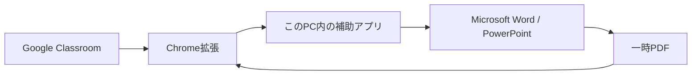

# Classroom Office Reviewer

Google Classroomの採点画面を離れずに、Word／PowerPoint提出物をMicrosoft Office本体で正確に表示する、Windows版Chrome拡張です。

- 学生を「前へ・次へ」で切り替えながら連続確認（次の変換中も前の表示を維持）
- Word／PowerPoint本体による高忠実度PDF表示
- Word別ウィンドウ、PowerPointスライドショー
- PDF全画面発表とキーボードページ送り
- 提出物を外部サーバーやAIへ送信しないローカル処理

> [!IMPORTANT]
> 本ツールはGoogleおよびMicrosoftの公式製品ではありません。Chromeウェブストア版ではないため、初回だけ拡張機能を手動で読み込みます。

## 動作環境

- Windows 10／11
- Google Chrome
- Microsoft Word（Word提出物を扱う場合）
- Microsoft PowerPoint（PowerPoint提出物を扱う場合）

配布ZIPには補助アプリの実行環境を同梱するため、Node.jsの別途インストールは不要です。

## 導入（初回のみ・約3分）

1. [最新版の配布ページ](https://github.com/MLabPages/classroom-office-reviewer/releases/latest)から `Classroom-Office-Reviewer-Windows.zip` をダウンロードします。
2. ZIPを右クリックして「すべて展開」します。ZIPの中から直接起動しないでください。
3. 展開先の `Start-Reviewer.cmd` をダブルクリックします。
4. `Open-Chrome-Setup.cmd` をダブルクリックします。
5. 開いたChrome画面で右上の「デベロッパー モード」をオンにします。
6. 「パッケージ化されていない拡張機能を読み込む」を押し、`extension` フォルダを選びます。
7. 開いているClassroomを再読み込みします。

Windowsの警告が出た場合は、ファイル名と配布元がこのリポジトリであることを確認してから実行してください。

## 使い方

ClassroomでWordまたはPowerPointの提出物を開くと、左下に操作パネルが表示されます。

| ボタン | 動作 |
|---|---|
| Wordで正確に表示 | Word本体でPDF化し、採点画面内に表示。先読みオンなら次の提出物も裏で準備 |
| Word別窓で表示 | Word本体で読み取り専用表示 |
| PowerPointを正確に表示 | PowerPoint本体でPDF化し、採点画面内に表示 |
| PowerPointで発表 | PowerPoint本体のスライドショーを開始 |
| 全画面 | PDFを発表用に全画面表示 |
| 機能OFF | 自動表示・プレビュー・Office別窓を停止 |

全画面中は、矢印キー、PageUp／PageDown、Spaceでページを送り、Escで終了します。「次を自動表示・先読み」をオンにすると、学生の切替後も同じ表示方法を続けます。現在の提出物を表示した後、次の学生の提出物を見えない画面で取得・PDF化しておくため、次へ進んだときは準備済みのPDFをすぐ表示できます。PDF上部には「先読み中」「OfficeでPDF化中」「準備完了」が表示されます。変換がまだ終わっていない場合も、前の提出物を消さずに表示します。通常表示も採点画面の大半を使う大きさになり、必要なら「全画面」と「＋」でさらに拡大できます。

## 提出物とプライバシー

- 元の提出物は通常メモリ内だけで受け渡し、外部の変換サービスやAIへ送りません。
- Google側の制限で一時取得した場合も、変換後にファイルとChromeの取得履歴を削除します。
- 表示用PDFは同じ提出物を開き直せるよう、最大30件・最終利用から8時間だけこのPC内に保持します。
- `Stop-Reviewer.cmd` で補助アプリを終了すると、表示用PDFをまとめて削除します。
- Officeマクロは無効にし、元ファイルを変更しない状態で開きます。

詳細は[プライバシー説明](PRIVACY.md)をご覧ください。

## 終了・削除

- 一時PDFを消して終了: `Stop-Reviewer.cmd`
- アンインストール: Chromeの拡張機能画面から本ツールを削除し、展開したフォルダを削除

## 困ったとき

- 左下のボタンが出ない: 拡張機能を再読み込みし、Classroomも再読み込みします。
- 「補助アプリが起動していません」: `Start-Reviewer.cmd` を起動します。
- 「補助アプリに接続できません」: 最新版へ更新後、`Start-Reviewer.cmd` を起動してClassroomを再読み込みします。
- レイアウトが変わる: 文書で使われたフォントがPCに入っているか確認します。
- パスワード付き／破損ファイルは変換できません。

不具合報告は[GitHub Issues](https://github.com/MLabPages/classroom-office-reviewer/issues)へお願いします。提出物そのものや学生の個人情報は添付しないでください。

## 開発者向け

ソースから使う場合はNode.js 20以降を用意し、`Start-Reviewer.cmd` を起動します。配布ZIPはタグ `v*` のpushでGitHub Actionsから自動生成されます。

- Chrome拡張: `extension/`
- ローカル補助アプリ: `native/server.mjs`
- Word／PowerPoint連携: `native/*.ps1`

## ライセンス

本体コードは[MIT License](LICENSE)です。PDF.jsはApache License 2.0で、ライセンス本文を `extension/vendor/pdfjs-LICENSE.txt` に同梱しています。その他の同梱物は[第三者ライセンス](THIRD_PARTY_NOTICES.md)をご確認ください。
